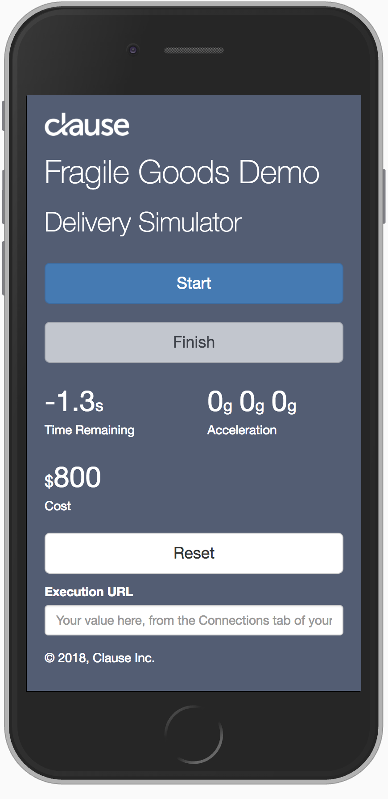
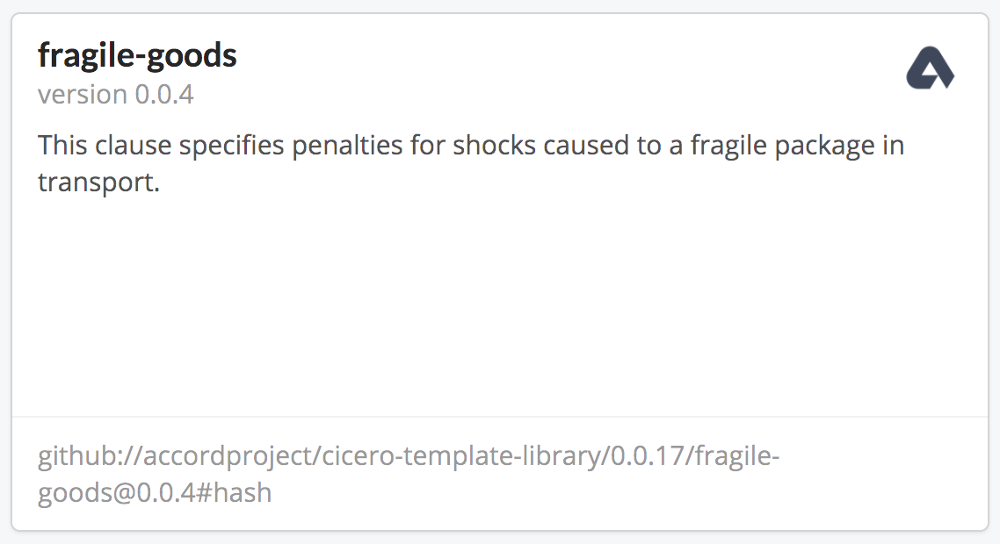
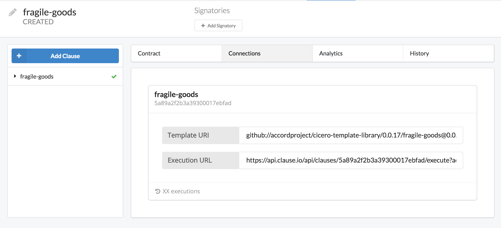

# Clause Demo Application



A demo client application that invokes a smart clause hosted on [Clause Hub](https://hub.clause.io). This app uses the [Fragile Goods sample](https://github.com/accordproject/cicero-template-library/tree/master/fragile-goods) template from the Cicero template library.

A hosted version of this app is available at [https://clause-fragile-goods-app.netlify.com](https://clause-fragile-goods-app.netlify.com)

## Running this demo on your machine

1. Download this repository.

You can either [download the latest release archive](https://github.com/clauseHQ/fragile-goods-app/archive/master.zip) or if you have `git` installed simply `git clone` the repository:

```
git clone https://github.com/clauseHQ/fragile-goods-app.git
```

2. Install the dependencies.

> You need NPM and Node run this app. You can download both from [here](https://nodejs.org/).

``` 
npm install 
```

3. Start the app.

```
npm start
```
You should see the following output.
```
mattmbp:fragile-goods-app matt$ npm start

> fragile-goods-app@0.0.1 start /Users/matt/dev/clauseHQ/fragile-goods-app
> node app.js

App running at http://localhost:3000

```

4. Open [http://localhost:3000](http://localhost:3000) in your browser.

5. Create an instance of the Fragile Goods clause in your Clause Hub account.

In the template libary choose the following template.



Click `Create Contract`.

Then switch to the `Connections` tab.


 
5. Paste in your execution URL from Clause Hub into the `Execution URL` field in the demo app.

6. Click the `Start` button in the app to begin the timer.

> Note that your device must have an accelerometer for this demo to pick up readings. Why not try this from your mobile phone?
> 
> If you don't have an accelerometer you can vary the delivery price by stopping the timer before / after it reaches 0 seconds. Late deliveries also impose a penalty.

7. You can reset the timer by clicking reset.

&copy; Copyright 2018, Clause Inc. 
